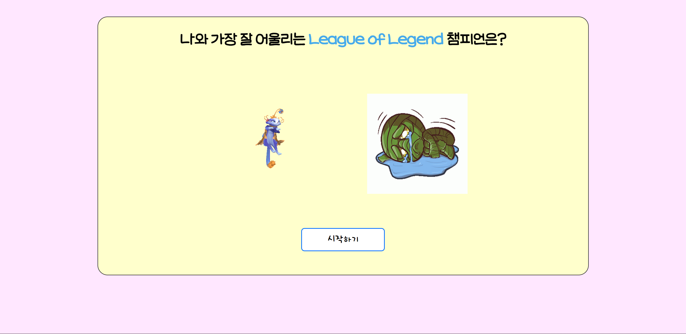

# [나와 가장 잘 어울리는 League of Legend 챔피언은?]

<!-- 이미지로 링크 이동하기 -->

<strong><a href="https://flask-my-webpage.herokuapp.com" target="_blank">사이트로 이동!!</a></strong>

## [개요]
- ## `Flask로 만드는 나만의 Webpage`

## [적용한 기술]
- `Front-end`: HTML, CSS, Javascript
- `Back-end`: Flask, Python
- `Deploy`: Heroku

## [작업 순서]
- 프론트 단 구축
- Flask로 로컬 서버에서 잘 되는지 확인
- Heroku에 Webpage 배포
- 디버깅